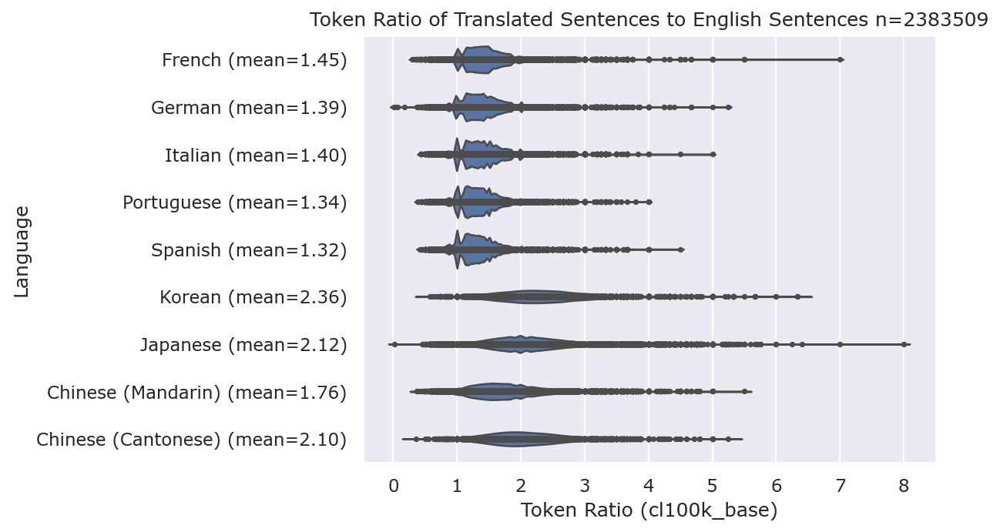

# Working with Chinese, Japanese, and Korean text in Generative AI pipelines


Large Language Models (LLMs) have been trained to predict the next part of a word, or "token", based on a training model of huge volumes of written text mostly from public Internet sources. Because English is the most widely spoken [language on the Internet](https://www.statista.com/statistics/262946/most-common-languages-on-the-internet/), LLMs are optimized to perform well in challenges with English.

LLMs have advanced capabilities for handling and generative text in many written languages. Azure AI Studio has a [model catalog](https://learn.microsoft.com/azure/ai-studio/how-to/model-catalog) for exploring and comparing many models as well as giving you the ability to deploy them directly onto Azure.

In this article we explore some best practices for handling text in Chinese, Japanese, and Korean with LLMs. This guidance applies to the following scenarios:

- Processing of text for vector-based, or semantic search
- Splitting or chunking text for storage in a vector database
- Reading text from documents for processing
- Working with text mode LLMs with written CJK text

## Tokenization

Before text can be processed by an LLM it needs to be converted from a text string into an array of numbers called *tokens*. The mapping between the word, or part of a word and the token is calculated using an algorithm called a Byte-Pair-Encoder (BPE). The BPE algorithm works with an encoding and iterates through a piece of text to find way of representing that text with the fewest number of tokens. 

The number of tokens is relevant for two reasons: 

1. LLM APIs are billable by the number of tokens, not by the number of letters or words. All API limits and throttling is configured to tokens.
2. The recall performance of LLMs is impacted by the number of input tokens, to a sweet-spot depending on the model. Ideally, LLMs should be given a smaller "context window" from which to derive facts and information. 

So, for those two reasons we greatly care about the number of tokens for a piece of text.

The BPE encoding for GPT 3.5 and GPT 4 is the cl100k_base, which has roughly 100,000 tokens. Each token is a mapping to a word, or part of a word and a unique number. In `cl100k_base`, the message "This is the life" is 4 tokens, "This" (2028) " is" (374) " the" (279) and " life" (2324). Unlike embeddings, tokenized strings are bidirectional so you can convert text into tokens and back again without losing information. You can try this in Python for GPT-3.5 and GPT-4 encodings using the `tiktoken` package:

```python
>>> import tiktoken
>>> enc = tiktoken.get_encoding('cl100k_base')
>>> enc.encode("This is the life")
[2028, 374, 279, 2324]
>>> enc.decode([2028, 374, 279, 2324])
'This is the life'
```

This particular byte-pair-coding has 100,000 possible tokens for every written language which is possible by assigning words or parts of words which occur frequently (like "This") their own token. Words and mispellings can also be tokenized using parts of words as tokens. A mispelling like "Thiss" is 2 tokens, "Th" and "iss". Each letter in the Latin Alphabet has it's own token so the never of tokens would never exceed the number of characters for English. A general rule of thumb is that one token corresponds to around 4 characters of text for common English text.

Because CJK languages do not use the latin alphabet, we need to consider a different ratio of words to tokens. 

A good example is the character used in both Chinese (Māo) and Japanese (Neko) for cat (猫). The 猫 character part of the Unicode CJK Unified Ideographs which includes over 97,000 characters. Since the cl100k_base encoding only has space for ~100,000 possible tokens the the CJK Unified Ideographs alone would take up most of space so most characters are 2 or 3 tokens. Encoded into cl100k_base, the 猫 character becomes 3 tokens:

```python
>>> enc.encode("猫")
[163, 234, 104]
```

More commonly used characters like 三 (3 in both Chinese and Japanese) are only one token (46091). In some cases the character represents a concept like "Memorize" far more concisely. The character for memorise is 覚 (2 tokens) whereas the word "Memorize" is 3 tokens.

To better understand how the density of information-to-tokens, we looked a dataset of over 2 million translated sentences and measured the ratio of tokens between English and the target language. As a baseline, the most widely spoken Indo-European languages that also use the Latin Alphabet (French, German, Italian, Portuguese, and Spanish) were included:



For a language like Japanese that has both Kanji and Kana, sentences can be up to 8x the number of tokens of the English equivalent, but average at 2.12.

Mandarin has an average token ratio of 1.76, Cantonese has 2.10 and Korean 2.36. 

There are occassions where sentences in CJK languages will be fewer tokens than the English equivalent because the expression or phase can be said more concisely. For example, "This is the first time I've heard about it." (11 tokens) can be said in Japanese 
"初耳だ" (5 tokens). These cases are the exception, not the rule and it could be argued that a native English speaker would use a more colloqial term like "news to me" (3 tokens).

### Korean Hangul and Tokenization

So far we've focused mostly on Japanese Kanji and Chinese. In the Korean writing system, the 14 basic  consonants and 10 vowels are combined into a single syllabic symbol. In Unicode, over 11,000 precomposed syllabic symbols are defined in the [Unicode Standard AC00 block](https://unicode.org/charts/PDF/UAC00.pdf). This Unicode block has over precomposed syllables so that text processors to not need to combine Hangul vowels and consonants into a single symbol. Because BPE works with Unicode code points, not with the Hangul letters the frequency of that syllable is more important to the component letters. For example, the first syllable in my name, "An" is two tokens for 앤 and seven tokens for it's component letters, "ㅇㅐㄴ":

```python
>>> enc.encode("앤")
[31495, 97]
>>> enc.encode("ㅇㅐㄴ")
[70787, 229, 70787, 238, 159, 226, 112]
```

In summary, although Hangul is an elegant writing system, the [complexity of the Unicode implementation](https://www.unicode.org/L2/L2006/06310-hangul-decompose9.pdf) impacts the token density. You would think that with 40 basic letters, Korean would have a better token density to Japanese which has 2 writing systems and thousands of characters, but instead the opposite is true. Expect a ratio of 2.36x the number of tokens for Korean than the equivalent information in English. 

### Summary and recommendations


- Ideagraphic text
- Working with mixed language text
- Japanese specifics
- Assumptions about
- Ruby character https://en.wikipedia.org/wiki/Ruby_character

## Text Analysis

- Stemming and Lemmatization

## Text splitting

- General overlapping rules
- JIS 2004 character endings and breaks
- Token based recursive splitters

## Special considerations for document procesing

- Working with PDFS
- Top-to-bottom 
    - MS word support
